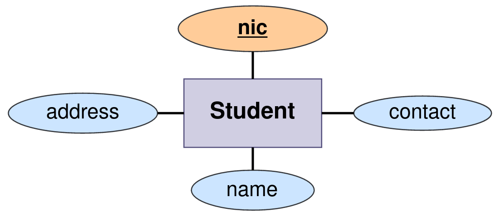

# Student Management System - Back End 

This project was developed using **Spring Boot** framework with having **n-tier architecture** in order to understand and improve the 
knowledge of spring boot and software architectures.
The fundamental **CRUD activities** of a student management system are present in this project.
Web services are exposed as APIs under the **students** resource in this project.

More information on the exposed web services with example test cases can be found in the 
API documentation listed below.
- [**Students API documentation**](https://documenter.getpostman.com/view/25306703/2s93JtQPYm)

#### Highlighted features of the application,
- Students are registered to the system by their NIC number.
- A system administrator can enter, amend, remove, and retrieve student information.

#### Few snapshots of the documentation
- An attempt to update a student that does not exist in the database. 

[//]: # ()

- Send incorrect JSON in request payload. 

[//]: # ()

- An attempt to register a student that already exist in the database. 

[//]: # ()

- Null return items found in request payload. 

[//]: # ()

#### ERD of the database

## Used Technologies

- Java SE 11
- Spring Boot 2.7.8
- Apache Maven 3.8.6
- MySQL Community Server 8.0.31
- Added dependencies to pom.xml
    - spring-boot-starter-web 2.7.8
    - spring-boot-starter-validation 2.7.8
    - spring-boot-starter-data-jpa 2.7.8
    - spring-boot-starter-aop 2.7.8
    - spring-boot-starter-test 2.7.8
    - spring-boot-devtools
    - lombok 1.18.24
    - mysql-connector-j 8.0.31
    - modelmapper 3.1.0

#### Used Integrated Development Environment
- IntelliJ IDEA

## How to use ?
This project can be used by cloning the 
project to your local computer.

Make sure to create a **student_app_db** database in the MySQL community server.
If you neglect to create it, the project will automatically generate it when it is first executed.

#### Clone this repository
1. Clone the project using `https://github.com/PubuduJ/student-management-system-back-end.git` terminal command.
2. Open the `pom.xml` file from **IntelliJ IDEA**, make sure to open this as a project.

## Credits
This project was carried out under the guidance of the [IJSE](https://www.ijse.lk/) Direct Entry Program 9.

## Version
v1.0.0

## License
Copyright &copy; 2023 [Pubudu Janith](https://www.linkedin.com/in/pubudujanith94/). All Rights Reserved. 
This project is licensed under the [MIT license](LICENSE.txt).